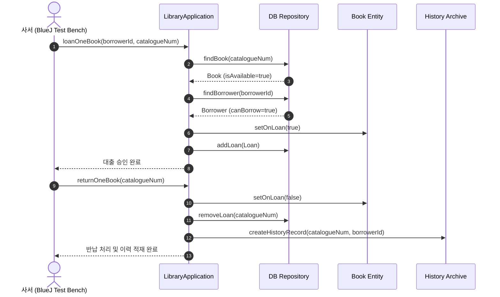
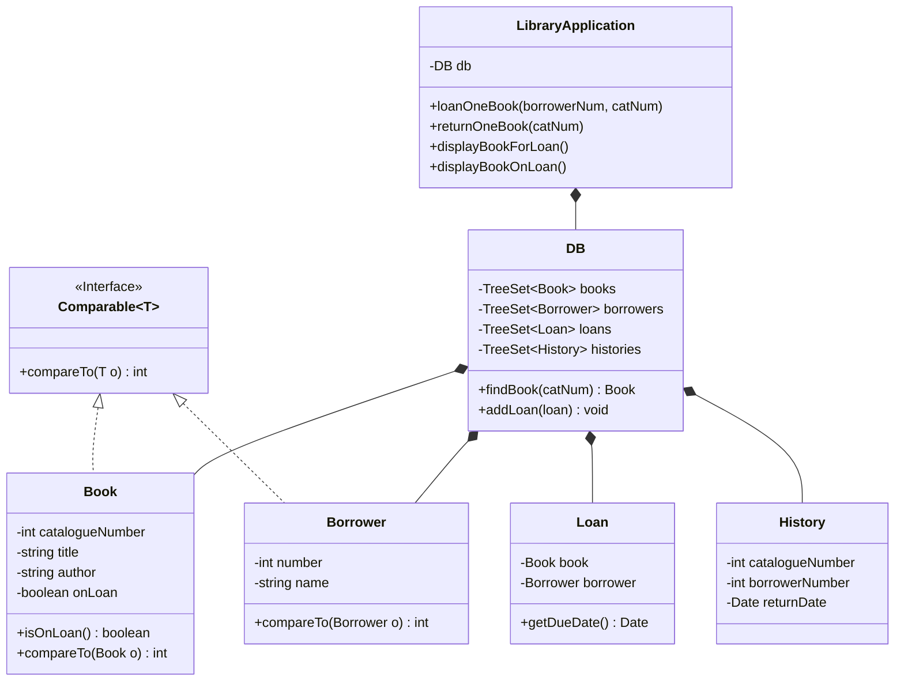

# Library Domain Logic | Iterator & TreeSet 기반 도서관 업무 도메인 모델

> Java 컬렉션 프레임워크의 `TreeSet`과 `Comparable` 인터페이스로 정렬된 도서/대출 엔티티를 관리하고, `Iterator` 패턴을 적용하여 대출 가능 여부 판정, 대출 트랜잭션, 반납 및 이력 아카이빙을 캡슐화한 객체지향 도메인 설계 프로젝트

---

[시스템 개요 및 빠른 시작](#1-프로젝트-개요-project-overview)
- [핵심 설계 가치 (OOP & Iterator Pattern)](#2-핵심-설계-가치-oop--iterator-pattern)
- [코어 비즈니스 트랜잭션 흐름](#3-코어-비즈니스-트랜잭션-흐름-core-pipeline--mechanics)
- [도메인 모델 및 클래스 계층도](#4-도메인-모델-및-클래스-계층도-technical-architecture)
- [소스 코드 구현 명세](#5-소스-코드-구현-명세-core-architecture--implementation)
- [핵심 테크니컬 하이라이트](#6-핵심-테크니컬-하이라이트-technical-highlights)
- [BlueJ 객체 지향 실행 가이드](#7-bluej-객체-지향-실행-가이드-system-requirements)

---

### 1. 프로젝트 개요 (Project Overview)

* **도메인 / 분야:** 객체지향 도메인 모델링(Domain Modeling) · Iterator 패턴 · TreeSet 자가 정렬 컬렉션
* **플랫폼 / 런타임:** Java Standard Edition (SE) / BlueJ 객체 벤치 실행 환경
* **핵심 도메인 객체:** `Book`, `Borrower`, `Loan`, `History`, `DB`, `LibraryApplication`
* **핵심 기술 스택:** `Java 11+` · `TreeSet` · `Comparable<T>` · `Iterator<T>` · `BlueJ`

---

### 2. 핵심 설계 가치 (OOP & Iterator Pattern)

* **USP-1. 자가 정렬(Self-Sorting) 컬렉션: `TreeSet`과 `Comparable` 구현**
  * 도서(청구기호 기준) 및 이용자(등록번호 기준) 객체에 `Comparable`을 구현하여, 삽입 시점에 자동으로 정렬된 상태를 유지하고 $O(\log N)$ 탐색 보장.
* **USP-2. 이터레이터(Iterator) 기반 조건부 필터링 및 대출/반납 라이프사이클**
  * 도서 대출 시 `Iterator`를 순회하며 대출 가능(Available) 상태를 검증하고, 반납 시 `Loan` 객체를 파기함과 동시에 불변 `History` 엔티티로 승격 아카이빙.
* **USP-3. 상태 패턴 준수 및 다형성 도메인 분리**
  * 도서의 대출 상태 플래그 변경, 이용자별 최대 대출 허용 한도 검증 로직을 도메인 레이어에 캡슐화.

---

### 3. 코어 비즈니스 트랜잭션 흐름 (Core Pipeline & Mechanics)



---

### 4. 도메인 모델 및 클래스 계층도 (Technical Architecture)



---

### 5. 소스 코드 구현 명세 (Core Architecture & Implementation)

```
Iterator-1/
├── LibraryApplication.java            # 전체 비즈니스 오케스트레이터 (대출/반납/조회 메서드)
├── DB/
│   └── DB.java                        # TreeSet 기반 인메모리 도메인 저장소 및 Iterator 검색 엔진
├── Object/
│   ├── Book.java                      # 도서 엔티티 (청구기호 정렬 및 대출 상태 관리)
│   ├── Borrower.java                  # 이용자 엔티티 (회원번호 정렬)
│   ├── Loan.java                      # 활성 대출 트랜잭션 복합 객체 (Book + Borrower)
│   └── History.java                   # 반납 완료된 불변 감사(Audit) 로그 엔티티
└── package.bluej                      # BlueJ IDE 프로젝트 및 비주얼 클래스 다이어그램 메타
```

---

### 6. 핵심 테크니컬 하이라이트 (Technical Highlights)

| 구분 | 적용 기술 및 설계 패턴 | 구현 효과 및 엔지니어링 의사결정 이유 |
| :--- | :--- | :--- |
| **정렬 불변성** | `TreeSet<T>` + Red-Black Tree | 별도 정렬 알고리즘 호출 없이도 모든 엔티티를 고유 식별자 순서로 항상 정렬 보장 |
| **순회 캡슐화** | `Iterator<T>` Pattern | 내부 저장소 구조(`TreeSet`)를 외부에 노출하지 않고 대출 가능 도서만 선택적 순회 |
| **감사 추적성** | Active Loan vs Inactive History 분리 | 현재 진행 중인 대출과 과거 반납 기록을 명확히 분리하여 데이터 오염 방지 |

---

### 7. BlueJ 객체 지향 실행 가이드 (System Requirements)

#### 요구 사양
* **IDE:** BlueJ (객체 인스턴스화 및 인터랙티브 메서드 호출에 최적화) 또는 표준 JDK
* **실행 절차:**
  1. BlueJ에서 `package.bluej`를 엽니다.
  2. `LibraryApplication` 클래스를 우클릭하여 `new LibraryApplication("중앙도서관")` 인스턴스를 생성합니다.
  3. 생성된 객체 인스턴스를 클릭하여 `displayBookForLoan()`, `loanOneBook()`, `returnOneBook()` 메서드를 순차적으로 호출하며 콘솔 로그를 확인합니다.
